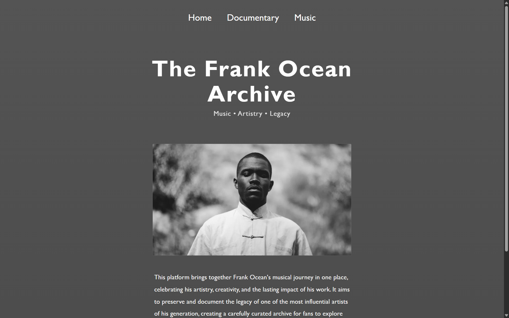
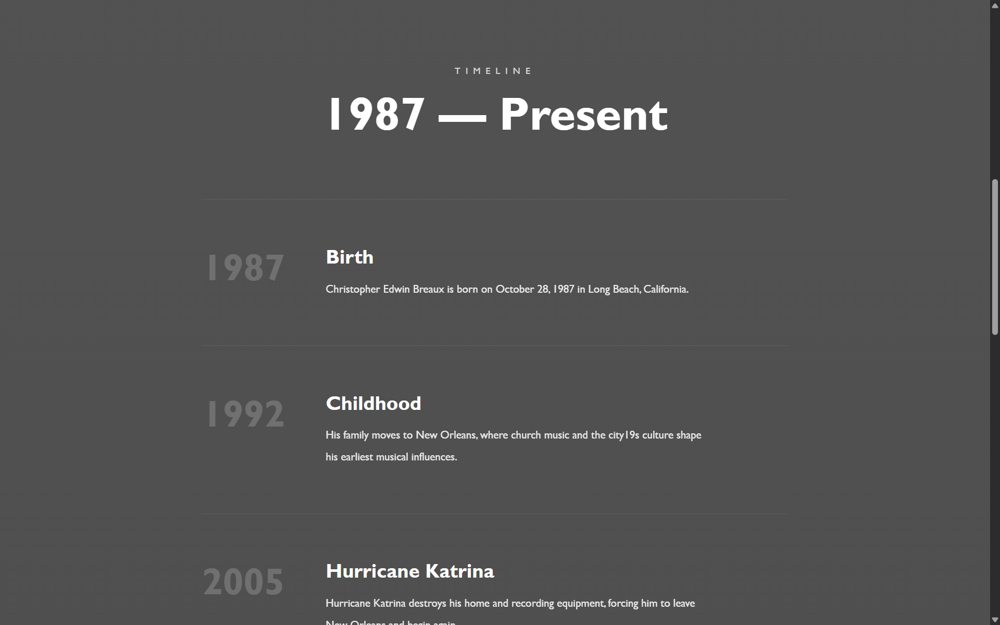
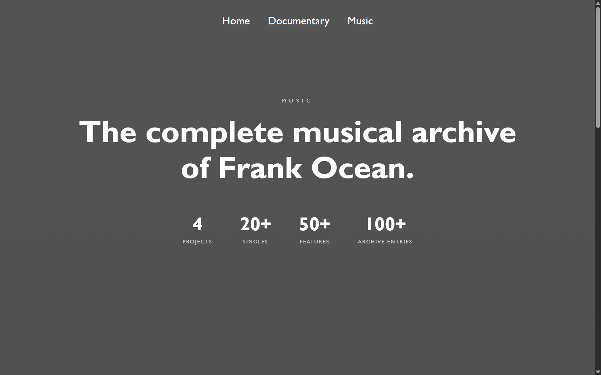

# The Frank Ocean Archive

An open-source archive documenting Frank Ocean's music, artistry, and creative legacy through a clean, minimal web experience.

---

## Preview-
<br>


### Home


<br><br><br>

### Documentary


<br><br><br>

### Music



<br><br><br>

##### Check out  resources/screenshots/ for more
---

## Project Structure

```text
The-Frank-Ocean-Archive/
│
├── resources/
│   ├── images/
│   └── screenshots/
│
├── styles/
│   ├── style.css
│   ├── documentary.css
│   └── music.css
│
├── index.html
├── documentary.html
├── music.html
│
├── LICENSE
├── .gitignore
└── README.md
```

---

## Contributing

Contributions are always welcome.

You can help by:

- Improving the UI/UX
- Making the website responsive
- Fixing bugs
- Refactoring HTML, CSS, or JavaScript
- Improving accessibility
- Expanding the archive with verified information

### Looking for Contributors

The **Music** page is currently under active development, and I'd especially appreciate help with:

- Layout & UI/UX
- Visual direction
- Responsive design
- Interactions

---

## Getting Started

```bash
git clone https://github.com/animesh9807/The-Frank-Ocean-Archive.git
```

Open `index.html` in your browser.

No frameworks. No build tools. Just HTML, CSS, and JavaScript.

---

## Disclaimer

This is an unofficial fan-made project and is not affiliated with Frank Ocean or any associated entities.

Album artwork and other copyrighted material remain the property of their respective owners and are used for identification and archival purposes only.

---

Built by fans, for fans.