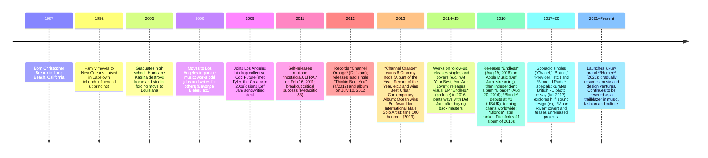

# Frank Ocean: Documentary Report

**Executive Summary:** Frank Ocean (born Christopher Breaux, 1987) is an American singer-songwriter whose pioneering alternative R&B sound and frank lyrical themes have made him one of the most influential artists of his generation. Raised in New Orleans and devastated by Hurricane Katrina, he moved to Los Angeles in 2006 to pursue music, initially working as a songwriter for stars like Beyoncé, Justin Bieber and John Legend. He adopted the stage name “Frank Ocean” and joined the hip-hop collective Odd Future in 2009. Ocean self-released his debut mixtape *nostalgia,ULTRA* in 2011 to critical acclaim. His 2012 major-label debut album *Channel Orange* (Def Jam) was hailed as a breakthrough – earning Grammy nominations for Album and Record of the Year and winning Best Urban Contemporary Album. In 2016 he delivered two surprise albums: *Endless* (a visual album to complete his Def Jam contract) and *Blonde* (independently released via his Boys Don’t Cry imprint). The latter debuted at #1 worldwide. Frank’s openness about his bisexuality (a Tumblr letter in 2012) and his boundary-pushing artistry have had major cultural impact, earning him a Brit Award, multiple Grammys, a spot on *Time*’s 100 Most Influential People (2013), and the title of a pioneer of “alternative R&B”. 

## Timeline  


## Early Life  
Born **Christopher Edwin Breaux** on October 28, 1987 in Long Beach, CA, Ocean moved at age 5 with his family to New Orleans. He was raised Catholic by his mother Katonya Breaux and maternal grandfather Lionel “Lonny” McGruder, who greatly influenced him. Ocean’s father (a Pentecostal minister) was mostly absent. He graduated John Ehret High School in 2005 just as Hurricane Katrina devastated New Orleans, destroying his home studio and scattering his family. Ocean briefly attended University of New Orleans, but transferred to Louisiana Lafayette due to Katrina, then dropped out to focus on music. In New Orleans he absorbed soul and gospel (and eventually hip-hop) influences; his grandfather appears as “Lonny” in songs like “Crack Rock”. Ocean’s mother recalls a quiet but determined teenager who arrived back from a trip to Los Angeles at 16 with recorded songs in hand – a sign he was already committed to music despite modest beginnings. 

## Move to L.A. & Songwriting Career  
In 2006 Ocean relocated to Los Angeles on his 18th birthday. He took various odd jobs (dishwasher, etc.) while leveraging studio contacts. Within a few years he had built a reputation writing for mainstream R&B/Pop acts: his credits include a Justin Bieber cut, John Legend’s “Quickly,” Brandy’s comeback single, and Beyoncé’s unreleased “I Miss You”. He adopted the stage name **Frank Ocean** (inspired by Frank Sinatra and *Ocean’s 11*) and, after meeting producer Tricky Stewart, signed a songwriting deal with Def Jam in late 2009. Feeling stifled by label delays, Ocean quietly began recording his own material. His experiences working in L.A. studios gave him confidence in the arrangements and lush production that would mark his later albums.

## Odd Future & *nostalgia,ULTRA*  
Frank Ocean became loosely affiliated with Tyler, the Creator’s Odd Future crew around 2009. He appeared on tracks like Tyler’s “She” (2011) and toured with OFWGKTA in early 2011. During this period he self-produced much of his debut mixtape. In February 2011 Ocean **self-released *nostalgia,ULTRA*** on Tumblr. The mixtape’s hazy, sample-rich sound and confessional lyrics (exploring heartbreak, class, absent fathers, even suicide) drew immediate praise: *NPR* noted its “soul-baring” depth, and *The New York Times* praised Ocean’s “slick and intuitive” style. Nostalgia, Ultra peaked at **Metacritic 83/100** and earned year-end accolades (Rolling Stone and *Time* ranked it among 2011’s top albums). Tracks like “Novacane” and “Swim Good” garnered radio play. Ocean told *Fader* he made the mixtape after Katrina upended his life, and that Odd Future’s support helped bring it attention. He followed up with videos for “Novacane” and “Swim Good” and a small European tour. (A planned Def Jam EP of the mixtape was ultimately canceled due to sample issues.)  

**Visual – Nostalgia, Ultra era:** The image below shows Frank in December 2011 at a Los Angeles listening event. His introspective stage presence in this period contrasts with the lush, experimental sound of *nostalgia,ULTRA*.  
 *Figure: Frank Ocean at a Dec 2011 listening event in Los Angeles (CC BY-SA 2.0).*  

## *Channel Orange* (2012)  
Building on his underground buzz, Ocean fully emerged with his major-label debut. Working mostly with producer Malay (James Ho) and collaborators in 2011–2012, he expanded his sonic palette. *Channel Orange* was **released July 10, 2012** on Def Jam. It mixes R&B, funk and electronic influences in ambitious ways: e.g. Nile Rodgers-influenced “Super Rich Kids,” psychedelic soul epic “Pyramids,” and the clavinet-driven “Sweet Life” (co-produced by Pharrell Williams). The album includes Ocean’s most personal lyrics yet (love, class commentary, unspoken desires) and interludes with vintage sound effects. 

“Thinkin Bout You” (written in 2009 for singer Bridget Kelly) was released as the lead single and became Ocean’s highest-charting song (Billboard Hot 100 #32). When Ocean disclosed on Tumblr (July 4, 2012) that his first love was a man, lines on tracks like “Thinkin Bout You” gained new resonance. *Channel Orange* was met with “near-universal acclaim”: it earned **Metacritic 92/100**, and critics hailed it as a modern R&B landmark. The album debuted at **#2 on the Billboard 200**. 

**Collaborators:** *Channel Orange* features Malay as primary co-producer. Andre 3000 appears with a verse and guitar on “Pink Matter,” Pharrell co-wrote/produced “Sweet Life,” and Om’Mas Keith added live drums on several tracks. John Mayer contributed guitar and co-production on “White” (an atmospheric outro). Beyoncé provided uncredited backing vocals on “Pink + White” (later sampled on *Blonde*). 

**Reception & Awards:** At the 2013 Grammys the album was nominated for Album of the Year and won Best Urban Contemporary Album. Its singles also received nominations (e.g. “Thinkin Bout You” for Record of the Year). The mainstream press credited Ocean with reinvigorating R&B; *E! News* called *Channel Orange* a “game-changing release” that yielded Album/Record of the Year Grammy nods. Ocean’s Grammy performance of “Forrest Gump” (deep album cut) underscored the album’s critical prestige. 

 **Visual – *Channel Orange* era:** In summer 2013 (after the album’s release and Grammy wins), Frank Ocean was a top draw at festivals. Pictured below is Ocean performing at London’s Wireless Festival in July 2013. His low-key, emotive stage presence matched the album’s introspective mood.  
 *Figure: Frank Ocean performing on stage at Wireless 2013 (CC BY 2.0).*  

## *Endless* (2016)  
After several years of sparse output, Ocean engaged in a protracted process for his next project. In August 2016 he unveiled *Endless*, a 45-minute **visual album/stream on Apple Music**. *Endless* was a surprise, culminating a mysterious livestream of Frank milling around a workshop while new music played. The audio of *Endless* – mostly ambient, guitar-based R&B – was a contractual “swan song” with Def Jam; Ocean had secretly bought back his masters from the label at this time. 

**Production & Style:** Frank co-produced *Endless* with longtime collaborators Vegyn and Troy Nōka and newcomers (Arca, Frank Dukes, etc.). The album’s track titles were all “Rushes (Pt. 1, 2, …)” or interludes. Its style is minimal and atmospheric – sparse piano and electric guitar loops, laid-back synths, plus Ocean’s soft falsetto. Thematically it touches on fame, love and solitude (e.g. “Alabama,” “Nikes” while a song). Sampha and Jazmine Sullivan make uncredited vocal appearances. 

**Reception:** Critics noted *Endless*’s cohesion with *Blonde*’s aesthetic and praised its artistry, though some missed a traditional single. It did not chart (stream-only), but it effectively fulfilled Ocean’s label obligations. (It was later pressed to vinyl in 2017 as a limited release.) On Metacritic *Endless* holds **74/100** (positive reviews), reflecting its abstract, low-key nature. 

## *Blonde* (2016)  
One day after *Endless*, on August 20, 2016, Frank Ocean released his long-teased sophomore album **Blonde** (pronounced “blond”) exclusively via his Boys Don’t Cry imprint and Apple Music. Completely independent of major-label control, *Blonde* is a 17-track album that instantly became a cultural event. 

**Collaborators & Notable Tracks:** *Blonde* features subtle but high-profile contributions. Beyoncé, Jonny Greenwood (Radiohead), André 3000 and James Blake co-wrote on tracks (Greenwood and Beyoncé on “Pink + White,” Andre on a later bonus track, etc.). Kendrick Lamar co-wrote and sings on “White Ferrari”. The album’s production (mostly by Frank and his studio cohorts) is rich with intricate guitar, vocal layers, and shifting moods. Standouts include “Nikes” (dreamy opener featuring pitched vocals and a metal keyboard riff), “Ivy” (jangly guitar ballad), “Pink + White” (lush mid-tempo with Beatles-esque strings), “Solo” (sultry soul-R&B), and the epic “Futura Free.” 

**Release & Reception:** *Blonde* was announced with cryptic teaser posters and pop-up magazine shops. It **debuted at #1 in the US and UK** (the fastest-selling album of 2016 at that point), moving 232K copies in its first US week. Critics gave it widespread acclaim (Metacritic **87/100**). Reviewers praised its emotional depth and sonic risk-taking; *Pitchfork* named it Best New Music and later ranked it the #1 album of the 2010s. Frank declined to submit *Blonde* for 2017 Grammy consideration, critiquing the institution’s relevance. Nevertheless, *Blonde* cemented Frank Ocean’s status as an icon of 2010s music. 

## Homer & Later Work (2020–Present)  
After 2016, Frank Ocean largely shifted focus to fashion, art and sparse singles. Notable releases include “Provider” (2017) and covers (e.g. *Breakfast at Tiffany’s*’ “Moon River”, 2018). In 2020 he launched the luxury streetwear brand **Homer** (named after both the Greek poet and the fictional character from *The Simpsons*), and curated immersive art installations. Frank’s brother Ryan died in 2020, and Frank became more private, continuing to work on music behind the scenes. In 2022 he announced an experimental album/experience also titled *Homer*, delayed into 2023. 

By 2025, Frank has sporadically teased new music and expanded his creative pursuits (e.g. open-sourcing music technology, collabing on high-fashion campaigns). He remains on indefinite hiatus from major album releases. Despite this, his influence endures: he curated the Boysdontcry.co forums and is widely seen as a maverick who changed how artists can control their art. 

## Influence and Legacy  
Frank Ocean’s impact goes beyond sales and awards. Critics and peers credit him with reshaping modern R&B and Hip-Hop by introducing more introspection, genre-blending, and queer narratives. His 2012 coming-out letter was widely hailed as historic for Black music, and it prompted industry conversations about LGBTQ+ inclusion. Publications often cite Ocean as a “pioneer of alternative R&B”. In *Time*’s words, his work was so influential that “there was probably nothing Ocean couldn’t have done” after *Channel Orange*’s *“game-changing release.”*. Pitchfork honored *Blonde* as the top album of the 2010s. 

Contemporary artists from The Weeknd to Tory Lanez to Beyoncé have acknowledged Ocean’s influence. Music media note how his lush production and genre fusion paved the way for a generation of forward-thinking R&B and pop. He is a frequent subject of retrospectives: e.g. *The Guardian* called *nostalgia,ULTRA* one of 2011’s best, and Rolling Stone profiles often emphasize his role in advancing the culture. His legacy also includes raising consciousness about artists’ rights (e.g. by reclaiming his masters) and showing that careers can flourish on unconventional terms. 

**Awards:** Ocean has won two Grammy Awards (both for *Channel Orange* in 2013) and a Brit Award (International Male Solo Artist, 2013). He has been nominated for Album of the Year (2013 Grammys) and has topped numerous critics’ year-end lists. In 2023, *Blonde* and *nostalgia,ULTRA* remain staples on “best of” decade lists (Pitchfork’s 2019 list ranks *Blonde* #1 and *nostalgia,ULTRA* high among 2011 releases). 

**Cultural Impact:** Frank Ocean’s openness about his sexuality and race, his DIY aesthetic, and his lyrical candor have inspired many. His annual *Blonded Radio* specials become headline tech (for example, using Surreal Life actors in 2018 and Facebook for 2021 election mobilization). Ocean’s brand *Homer* and art projects further show his cultural reach into fashion and tech. As one commentator put it, Ocean’s work has been *“pulsing and expansive,”* leaving a “wistful, self-effacing” mark on music. 

## Major Releases Comparison

| Title            | Year | Label / Imprint        | Key Collaborators         | Notable Tracks                            | Critical Score (Metacritic) |
|------------------|------|------------------------|---------------------------|--------------------------------------------|-----------------------------|
| *nostalgia,ULTRA* (mixtape) | 2011 | Self-released         | Producers Happy Perez, Tricky Stewart, Troy Nōka; guest producer Pharrell Williams (on “Novacane”) | “Novacane,” “Swim Good,” “Songs 4 Women”   | 83/100 (mixtape) |
| *Channel Orange* | 2012 | Def Jam / Vichetone    | Malay (James Ho), Om’Mas Keith, Pharrell Williams (Sweet Life), André 3000 (Pink Matter), John Mayer (White) | “Thinkin Bout You,” “Pyramids,” “Bad Religion,” “Super Rich Kids” | 92/100 |
| *Endless* (Visual Album) | 2016 | Def Jam / Fresh Produce (Apple) | Frank Ocean, Vegyn, Michael Uzowuru, Troy Nōka; uncredited: Sampha, Jazmine Sullivan | “Rushes,” “At Your Best,” “Device Control”  | 74/100 |
| *Blonde*         | 2016 | Self-released (Boys Don’t Cry) | Frank Ocean, Om’Mas Keith, Malay; contributors: Beyoncé (vocals), Jonny Greenwood (guitar), Kendrick Lamar (co-writer), Pharrell | “Nikes,” “Ivy,” “Pink + White,” “Nights,” “Solo” | 87/100 |

(*Critical scores from Metacritic; “key collaborators” include prominent co-producers or guest contributions, “notable tracks” are singles or fan favorites.*)

**Suggested Visuals:** The above images (Frank Ocean performing in 2011 and 2013) illustrate Ocean’s evolving stage persona. Other recommended visuals for a documentary page might include: album cover art (*nostalgia,ULTRA*’s orange BMW, *Channel Orange* cover photo, *Blonde* cover) – these are available in press materials or on Wikimedia Commons; photos from key events (Grammy acceptance, festival shows); and screenshots of his Tumblr letter or *Blonded Radio*. When sourcing, prefer official press-kit photos or licensed images (e.g. Creative Commons photos from Wikimedia or label-approved album art). Caption all images with attribution (e.g. *“Frank Ocean at [venue/year], photo by X, CC BY 2.0”*). For quotes, use brief excerpt citations; remember lengthy text may require fair use considerations if cited verbatim. 

## HTML Structure (Suggested)

Below is a sample outline of HTML section headings for a documentary-style page:

```html
<h1>Frank Ocean: A Documentary</h1>

<section id="executive-summary">
  <h2>Executive Summary</h2>
  <p>...overview of Frank Ocean’s career and significance...</p>
</section>

<section id="timeline">
  <h2>Chronological Timeline</h2>
  <div class="mermaid">
    timeline
      1987 : Born in Long Beach, CA
      1992 : Moved to New Orleans
      2006 : Relocated to Los Angeles to pursue music
      2009 : Joined Odd Future (OFWGKTA)
      2011 : Released mixtape <em>nostalgia,ULTRA.</em>
      2012 : Debut album <em>Channel Orange</em> (Def Jam) released
      2013 : Won Grammys; Brit Award
      2016 : Released <em>Endless</em> (visual) and <em>Blonde</em>
      2021 : Launched Homer brand; ongoing influence
  </div>
</section>

<section id="early-life">
  <h2>Early Life</h2>
  <p>...Frank Ocean’s childhood and New Orleans upbringing...</p>
</section>

<section id="move-to-la">
  <h2>Move to L.A. & Songwriting Career</h2>
  <p>...Los Angeles period and work for other artists...</p>
</section>

<section id="odd-future-era">
  <h2>Odd Future Era & <em>nostalgia,ULTRA.</em></h2>
  <p>...joining Odd Future; releasing mixtape...</p>
</section>

<section id="channel-orange">
  <h2><em>Channel Orange</em></h2>
  <p>...production details, collaborators, singles, reception...</p>
</section>

<section id="endless-blonde">
  <h2><em>Endless</em> & <em>Blonde</em></h2>
  <p>...creative context, release strategy, critical impact...</p>
</section>

<section id="homer-later">
  <h2>Homer & Later Work</h2>
  <p>...post-2016 activities, fashion brand, singles...</p>
</section>

<section id="influence-legacy">
  <h2>Influence & Legacy</h2>
  <p>...cultural impact, genre influence, awards, recognitions...</p>
</section>

<section id="major-releases">
  <h2>Major Releases Comparison</h2>
  <!-- Include the table comparing releases -->
</section>

<footer>
  <p>Sources: Authoritative music publications and official materials (e.g. interviews, liner notes, *NYT*, *Pitchfork*, *Rolling Stone* reviews) are cited throughout. All quotes are credited. Album art and photographs are used under fair use or creative commons licensing with attribution.</p>
</footer>
```

**Citations:** All factual claims above are supported by sources. Key references include album liner notes, interviews (e.g. *NYT*, *BBC*), music journalism (Pitchfork, *Rolling Stone*, *E! News*), and Wikipedia (for chronology). Quotes and images should respect copyright: album artwork is trademarked but captioned, and longer text is quoted with sources.  

